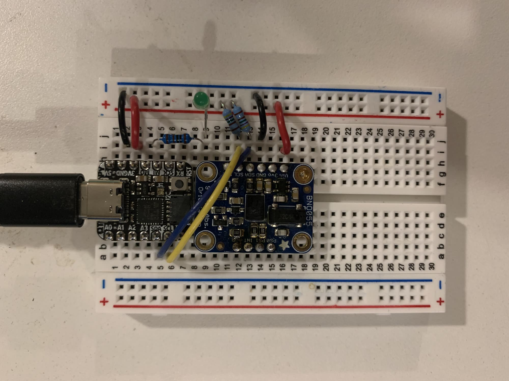
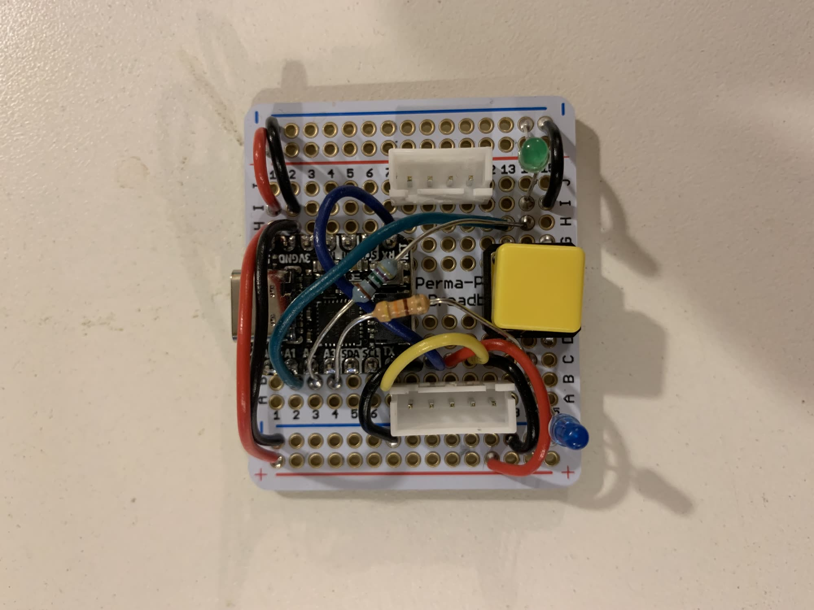
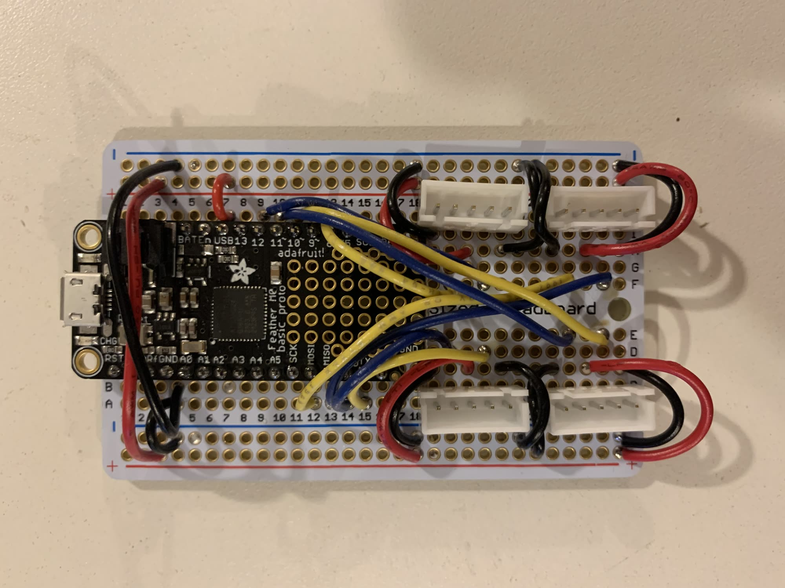
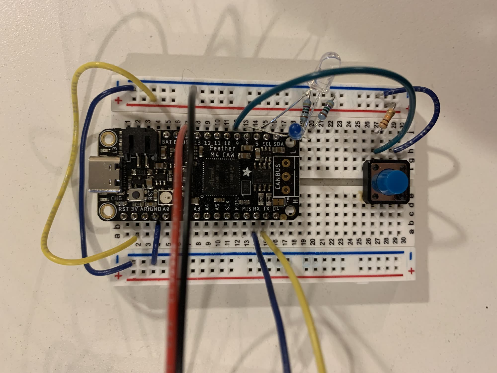

## OSAP-Mule Embedded Demos

I build these using [vscode w/ platformio](https://platformio.org/) and I *really* recommend you do as well. If you install PIO and open it up in any of these folders, you will immediately be able to build projects with:

`ctrl + alt + b`

And upload using:

`ctrla + alt + u` 

It's beautiful. A real IDE.

### QTPY-D21-BNO

This is an Adafruit QTPY M0 w/ the BNO055 accelerometer mounted.

### QTPY-D21-Wire

I built this originally to develop a link layer for Arduino's `Wire.h` instances, then it just became a nice tiny button-and-led demo. 

### Feather-M0-Multiserial

This is a kind of "router" / knuckle-node. In order to build all four `Serialx` instances, you need to make some edits to your arduino core files, notes are [here from adafruit](https://learn.adafruit.com/using-atsamd21-sercom-to-add-more-spi-i2c-serial-ports/creating-a-new-serial). 

### Feather-M4-Can-Button-LED

This is just another button-and-led pair.

### Adapting Sketches to your Arduino

Platformio is platform agnostic, but particular projects are platform specific. That doesn't mean you can't adapt the examples to other arduinos... I haven't used any platform specific instances of anything, save for the `M0-Multiserial` sketch. 

### Qualification

Last note: my apologies that this isn't better documented at the moment. It's new! If you're stoked about it but can't get something to work, [bother me](https://github.com/jakeread/) and (even though I may not respond) I *will* think about carving out a day to make some better how-to guides. Useful info: tell me exactly what you would like to do with the project! And tell me how experienced you are with firmware / hardware / etc. 